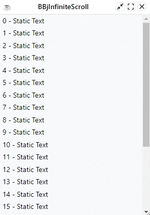
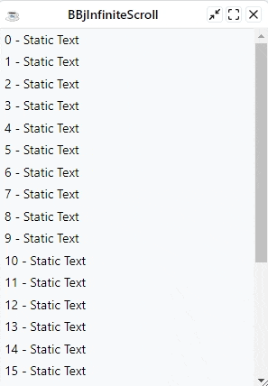
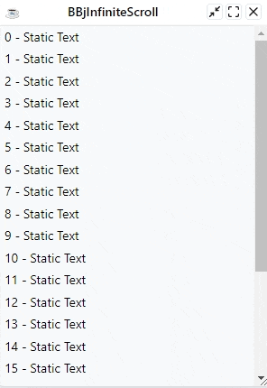
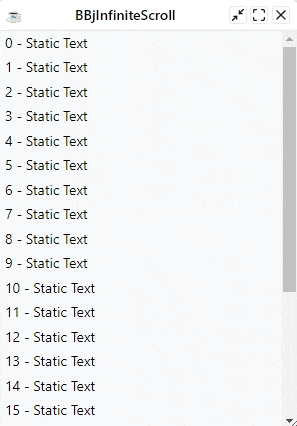
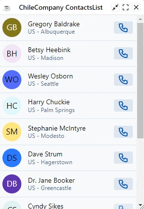

# BBjInfiniteScroll Widget

<p>
  <a href="http://www.basis.cloud/downloads">
    
  </a>
  <a href="https://github.com/BBj-Plugins/BBjInfiniteScroll/blob/master/README.md">
    
  </a>
  <a href="https://github.com/necolas/issue-guidelines/blob/master/CONTRIBUTING.md#pull-requests">
    
  </a>
   <a href="https://basishub.github.io/basis-next/#/dwc/dwc-infinite-scroll">
    
  </a>
</p>

BBjInfiniteScroll lets a user loads content continuously as the user scrolls down, eliminating the need for pagination.

?> **Note:** Infinite scrolling is a technique that loads more content as you scroll. It allows you to continue scrolling indefinitely and is sometimes known as endless scrolling. The technique is often used in social media feeds.

## Features

- Easy to set up
- Easy to customize
- Provide a paginator helper to paginate the data

And much more !

## Installation

- Clone the [project](https://github.com/BBj-Plugins/BBjInfiniteScroll) locally , then add `BBjInfiniteScroll` to your BBj paths
- Or [Use the plugins manager](https://www.bbj-plugins.com/en/get-started)

## The gist

```BBj
USE ::BBjInfiniteScroll/BBjInfiniteScroll.bbj::BBjInfiniteScroll
USE ::BBjInfiniteScroll/BBjInfiniteScroll.bbj::BBjInfiniteScrollEvent

wnd! = BBjAPI().openSysGui("X0").addWindow(10,10,300,400,"BBjInfiniteScroll")
wnd!.setCallback(BBjAPI.ON_CLOSE,"eoj")

infiniteScroll! = new BBjInfiniteScroll(wnd!)
infiniteScroll!.onScroll("onScroll")

lastIndex! = 0

PROCESS_EVENTS

onScroll:
  declare AUTO BBjInfiniteScrollEvent payload!

  ev! = BBjAPI().getLastEvent()
  payload! = ev!.getObject()

  control! = payload!.getControl()
  canvas! = control!.getCanvas()

  startIndex! =  lastIndex!
  endIndex! = lastIndex! + 20

  FOR i = startIndex! to endIndex!
    container! = canvas!.addChildWindow("", $00108800$, BBjAPI().getSysGui().getAvailableContext())
    container!.setStyle("padding", "var(--dwc-space-xs) var(--dwc-space-s)")
    container!.setAttribute("data-index", str(i))
    container!.addStaticText( str(i) + " - Static Text" ,$0000$)
    lastIndex! = lastIndex! + 1
  NEXT

  control!.update()
RETURN

eoj:
RELEASE
```

<br><br>
<div style="text-align: center;">
  
</div>
<br><br>

## Texts And Icons

You can configure the loading text and loading icon of the widget using 
the following methods:

- BBjInfiniteScroll.setText()
- BBjInfiniteScroll.setIcon()

Icons are strings which can be in any of the following formats:

- **Url**: (ex: /path/to/image.gif)
- **Data Url**: (ex: data:image/jpeg;base64,/9j/4SDpRXhpZgAAT....)
- **icon**: An icon to load from the default BBj icons pool. (ex: `animated-spinner`)
- **pool:icon**: An icon to load from the passed pool. (ex: `feather:load`)

```BBj
infiniteScroll! = new BBjInfiniteScroll(wnd!)
infiniteScroll!.setText("Wait a moment...")
infiniteScroll!.setIcon("https://cdnjs.cloudflare.com/ajax/libs/timelinejs/2.25/css/loading.gif")
```

<br><br>
<div style="text-align: center;">
  
</div>
<br><br>

## Events

BBjInfiniteScroll exposes only one event `onScroll`. You can listen to the `onScroll` event by setting a callback using the `BBjInfiniteScroll:onScroll` method. The event's payload is an instance of `BBjInfiniteScrollEvent`

## Pagination 

BBjInfiniteScroll ships a helper class `BBjInfiniteScrollPaginator` which can help you paginate your data. 

With `BBjInfiniteScrollPaginator` you set the total amount of the items
and number of items per page , then the paginator provides you with the:

- **StartIndex**: The index of the first item
- **EndIndex**: The index of the last item
- **TotalPages** : The number of available pages

You can navigate throw pages by setting the currentPage with the method `BBjInfiniteScrollPaginator.setCurrentPage`


?> **Note:** In the following sample, notice how we are using the `setCompleted` method to mark the end of infinite scrolling. Invoking this method won't update the canvas automatically , you still need to invoke `update` to update the canvas.

```BBj
USE ::BBjInfiniteScroll/BBjInfiniteScroll.bbj::BBjInfiniteScroll
USE ::BBjInfiniteScroll/BBjInfiniteScroll.bbj::BBjInfiniteScrollPaginator

wnd! = BBjAPI().openSysGui("X0").addWindow(10,10,300,400,"BBjInfiniteScroll")
wnd!.setCallback(BBjAPI.ON_CLOSE,"eoj")

infiniteScroll! = new BBjInfiniteScroll(wnd!)
infiniteScroll!.onScroll("onScroll")

paginator! = new BBjInfiniteScrollPaginator()
paginator!.setTotalItems(60)
paginator!.setPageSize(20)

canvas! = infiniteScroll!.getCanvas()

PROCESS_EVENTS

onScroll:
  startIndex! = paginator!.getStartIndex()
  endIndex! = paginator!.getEndIndex()

  IF(paginator!.getEndIndex() > -1)
    FOR i = startIndex! to endIndex!
      container! = canvas!.addChildWindow("", $00108800$, BBjAPI().getSysGui().getAvailableContext())
      container!.setStyle("padding", "var(--dwc-space-xs) var(--dwc-space-s)")
      container!.setAttribute("data-index", str(i))
      container!.addStaticText(str(i) + " - Static Text" ,$0000$)
    NEXT i

    currentPage! = paginator!.getCurrentPage()
    paginator!.setCurrentPage(currentPage! + 1)
  FI

  IF(endIndex! < 0 OR endIndex! = (paginator!.getTotalItems() -1))
    infiniteScroll!.setCompleted(1)
  FI

  infiniteScroll!.update()
RETURN

eoj:
RELEASE
```

<br><br>
<div style="text-align: center;">
  
</div>
<br><br>

## Pull To Refresh

The [BBjPullToRefresh](https://bbj-plugins.github.io/BBjPullToRefresh/#/) widget can be integrated easily with the `BBjInfiniteScroll` widget.  The `BBjPullToRefresh` must be registered on the BBjInfiniteScroll's canvas. 

?> **Note:** In the following sample, Notice how we are configuring the 
`BBjPullToRefresh` to be attached to the BBjInfiniteScroll's canvas itself instead of the canvas's parent. This give's the user the feeling that list is being pulled instead of the list's window


```BBj
USE ::BBjInfiniteScroll/BBjInfiniteScroll.bbj::BBjInfiniteScroll
USE ::BBjPullToRefresh/BBjPullToRefresh.bbj::BBjPullToRefresh

wnd! = BBjAPI().openSysGui("X0").addWindow(10,10,300,400,"BBjInfiniteScroll")
wnd!.setCallback(BBjAPI.ON_CLOSE,"eoj")

infiniteScroll! = new BBjInfiniteScroll(wnd!)
infiniteScroll!.onScroll("onScroll")

pullToRefresh! = new BBjPullToRefresh(infiniteScroll!.getCanvas(), BBjPullToRefresh.PREPEND_SELF)
pullToRefresh!.onRefresh("onRefresh")

lastIndex! = 0

PROCESS_EVENTS

onScroll:
  canvas! = infiniteScroll!.getCanvas()
  startIndex! =  lastIndex!
  endIndex! = lastIndex! + 20

  FOR i = startIndex! to endIndex!
    container! = canvas!.addChildWindow("", $00108800$, BBjAPI().getSysGui().getAvailableContext())
    container!.setStyle("padding", "var(--dwc-space-xs) var(--dwc-space-s)")
    container!.setAttribute("data-index", str(i))
    container!.addStaticText(str(i) + " - Static Text" ,$0000$)
    lastIndex! = lastIndex! + 1
  NEXT

  infiniteScroll!.update()
RETURN

onRefresh:
  lastIndex! = 0
  infiniteScroll!.setCompleted(1)
  infiniteScroll!.update()
  controls! = infiniteScroll!.getCanvas().getAllControls()
  size! = controls!.size() - 1

  FOR i = 0 to size!
    control! = controls!.get(i)

    IF(control!.getID() <> pullToRefresh!.getID())
      control!.destroy()
    FI
  NEXT i

  pullToRefresh!.finish()
  infiniteScroll!.setCompleted(0)
  infiniteScroll!.update()
RETURN

eoj:
RELEASE
```
<br><br>
<div style="text-align: center;">
  
</div>
<br><br>


## Contacts List Sample

The following sample , uses the ChileCompany customers table to build a paginated contacts list with 
infinity scrolling and pull to refresh.

```BBj
USE ::BBjInfiniteScroll/BBjInfiniteScroll.bbj::BBjInfiniteScroll
USE ::BBjInfiniteScroll/BBjInfiniteScroll.bbj::BBjInfiniteScrollPaginator
USE ::BBjPullToRefresh/BBjPullToRefresh.bbj::BBjPullToRefresh
USE com.basiscomponents.db.ResultSet
USE com.basiscomponents.bc.SqlQueryBC
USE java.nio.file.Files
USE java.nio.file.Paths

fs! = BBjAPI().getFileSystem()
css! = new String(Files.readAllBytes(Paths.get(fs!.resolvePath("./ContactsList.css"))))

web! = BBjAPI().getWebManager()
web!.injectStyle(css!, 0)

wnd! = BBjAPI().openSysGui("X0").addWindow(10,10,300,400,"ChileCompany ContactsList")
wnd!.setCallback(BBjAPI.ON_CLOSE,"eoj")

infiniteScroll! = new BBjInfiniteScroll(wnd!)
infiniteScroll!.onScroll("onScroll")
infiniteScrollCanvas! = infiniteScroll!.getCanvas()

pullToRefresh! = new BBjPullToRefresh(infiniteScrollCanvas!, BBjPullToRefresh.PREPEND_SELF)
pullToRefresh!.onRefresh("onRefresh")

sql! = new SqlQueryBC(BBjAPI().getJDBCConnection("ChileCompany"))
query! = "select count(*) as COUNT FROM CUSTOMER"

paginator! = new BBjInfiniteScrollPaginator()
paginator!.setTotalItems(sql!.retrieve(query!).getItem(0).getField("COUNT").getBigDecimal())
paginator!.setPageSize(10)

PROCESS_EVENTS

onScroll:
  startIndex! = paginator!.getStartIndex()
  endIndex! = paginator!.getEndIndex()

  IF(paginator!.getEndIndex() > -1)
    query! = "SELECT * FROM CUSTOMER limit " + str(startIndex! + 1) + "," +  str(paginator!.getPageSize())
    items! = sql!.retrieve(query!)
    iterator! = items!.iterator()

    WHILE iterator!.hasNext()
      item! = iterator!.next()
      firstName! = item!.getField("FIRST_NAME").getString().trim()
      lastName! = item!.getField("LAST_NAME").getString().trim()
      fullName! = firstName! + " " + lastName!
      phone! = item!.getField("PHONE").getString().trim()
      country! = item!.getField("COUNTRY").getString().trim()
      city! = item!.getField("CITY").getString().trim()
      fullLocation! = country! + " - " + city!

      card! = infiniteScrollCanvas!.addChildWindow("", $00108800$, BBjAPI().getSysGui().getAvailableContext())
      card!.addStyle("bookEntry")

      avatarContent! = "<html></html>"
      avatar! = card!.addStaticText(avatarContent!)

      avatar!.addStyle("bookEntry__avatar")
      info! = card!.addChildWindow("", $00108800$, BBjAPI().getSysGui().getAvailableContext())
      info!.addStyle("bookEntry__info")

      name! = info!.addStaticText(fullName!)
      name!.addStyle("bookEntry__name")

      location! = info!.addStaticText(fullLocation!)
      location!.addStyle("bookEntry__location")

      call! = card!.addButton("<html><dwc-icon name=""phone""></dwc-icon></html>")
      call!.setEnabled(len(phone!) > 0)
      call!.setUserData(phone!)
      call!.setCallback(call!.ON_BUTTON_PUSH, "onCall")
    WEND

    currentPage! = paginator!.getCurrentPage()
    paginator!.setCurrentPage(currentPage! + 1)
  FI

  IF(endIndex! < 0 OR endIndex! = (paginator!.getTotalItems() -1))
    infiniteScroll!.setCompleted(1)
  FI

  infiniteScroll!.update()
RETURN

onRefresh:
  infiniteScroll!.setCompleted(1)
  infiniteScroll!.update()
  controls! = infiniteScrollCanvas!.getAllControls()
  size! = controls!.size() - 1

  FOR i = 0 to size!
    control! = controls!.get(i)

    IF(control!.getID() <> pullToRefresh!.getID())
      control!.destroy()
    FI
  NEXT i

  pullToRefresh!.finish()
  paginator!.setCurrentPage(1)
  infiniteScroll!.setCompleted(0)
  infiniteScroll!.update()
RETURN

onCall:
  ev! = BBjAPI().getLastEvent()
  control! = ev!.getControl()
  phone! = str(control!.getUserData())
  script! = "" +
: "(() => {" +
: " const link = document.createElement('a');" +
: " link.href='tel:" + phone! + "';" +
: " link.style.visibility='hidden';" +
: " document.body.appendChild(link);" +
: " link.click();" +
: " document.body.removeChild(link)" +
: "})()"
  web!.executeScript(script!)
RETURN

eoj:
RELEASE
```

```css
/** ContactsList.css **/
.bookEntry {
  display: flex;
  gap: 1rem;
  align-items: center;
  padding: var(--dwc-space-s);
  cursor: var(--dwc-cursor-click);
  transition: background-color var(--dwc-transition);
  border-bottom: thin solid var(--dwc-color-default) !important;
}

.bookEntry:hover {
  background-color: var(--dwc-color-primary-alt);
}

.bookEntry__avatar {
  display: flex;
  align-items: center;
  width: var(--dwc-size-l);
  height: var(--dwc-size-l);
  border-radius: var(--dwc-border-radius-round);
}

.bookEntry__avatar img {
  width: 100%;
  height: 100%;
}

.bookEntry__info {
  flex: 1;
  display: flex;
  flex-direction: column;
}

.bookEntry__location {
  font-size: var(--dwc-font-size-s);
  color: var(--dwc-color-default-text);
}
```

<br><br>
<div style="text-align: center;">
  
</div>
<br><br>